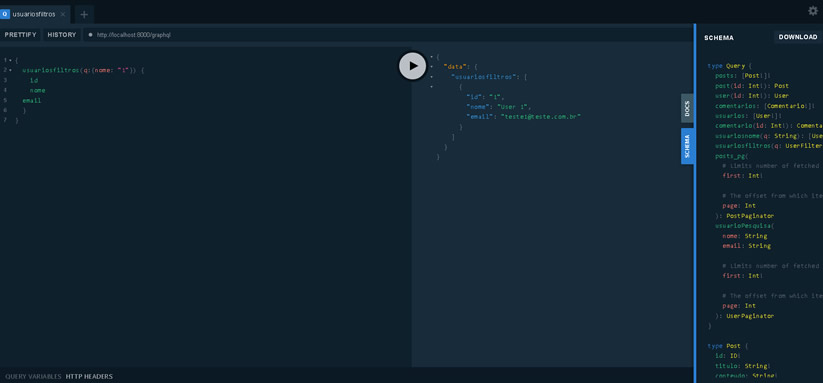

# Lumen PHP com GraphQL

Este projeto é uma API de exemplo utilizando o framework Lumen PHP integrado com o GraphQL 

GraphQL é uma linguagem de consulta criada pelo Facebook em 2012 e lançada publicamente em 2015. GraphQL é uma linguagem de consulta e ambiente de execução para APIs.

Como alternativa à arquitetura REST, o GraphQL permite aos desenvolvedores construir solicitações que extraem os dados de váriasfontes em uma única chamada de API. 

Os desenvolvedores de API usam o GraphQL para criar um schema que descreve todos os dados disponíveis para consulta pelos clientes por meio da API.

Um esquema do GraphQL é composto por tipos de objeto que definem os objeto que podem ser solicitados e quais campos eles terão.



## Instalação do projeto

Observação: Para executar este projeto você precisa ter a versão 8 do PHP ou superior.

> git clone https://github.com/dbins/lumen_graphql

> composer install

Dentro da pasta do projeto, execute

>php -S localhost:8000 -t public


## Passo a passo para criar o projeto

> composer create-project --prefer-dist laravel/lumen lumen_graphql
> cd lumen_graphql
> composer require nuwave/lighthouse

## Criar pasta config ##

> md config
> copy vendor\nuwave\lighthouse\src\lighthouse.php config

## Configuracões ##

Editar o arquivo bootstrap/app.php e adicionar a seguinte linha na seção "Register Config Files"

> $app->configure('lighthouse');

Editar o arquivo bootstrap/app.php e adicionar a seguinte linha na seção "Register Service Providers"

> $app->register(\Nuwave\Lighthouse\LighthouseServiceProvider::class);

Criando a pasta onde vai ficar o GraphQL

> md graphql

> copy vendor\nuwave\lighthouse\src\default-schema.graphql graphql\schema.graphql

Editar o arquivo bootstrap/app.php e adicionar as seguintes linhas na seção "Register Service Providers"

> $app->register(\Nuwave\Lighthouse\Pagination\PaginationServiceProvider::class);
 
> $app->register(\Nuwave\Lighthouse\Validation\ValidationServiceProvider::class);
 
> $app->register(\Nuwave\Lighthouse\GlobalId\GlobalIdServiceProvider::class);
 
> $app->register(\Nuwave\Lighthouse\OrderBy\OrderByServiceProvider::class);
 
> $app->register(\Nuwave\Lighthouse\SoftDeletes\SoftDeletesServiceProvider::class)
 
> $app->register(Flipbox\LumenGenerator\LumenGeneratorServiceProvider::class);

Descomentar a seguinte linha:

> $app->register(App\Providers\AuthServiceProvider::class);

No começo do arquivo bootstrap/app.php, na seção "Create The Application", descomentar as seguintes linhas:

> $app->withFacades();
 
> $app->withEloquent();

Por padrão, o endpoint para acessar o GraphQL é o /graphql.

## Suporte para a IDE ##
> php artisan lighthouse:ide-helper

## GraphQL Playground ##

Para testar com mais facilidade instale o GraphQL Playground

> composer require mll-lab/laravel-graphql-playground

Edite o arquivo bootstrap/app.php e adicione a seguinte linha na seção "Register Service Providers"

> $app->register(MLL\GraphQLPlayground\GraphQLPlaygroundServiceProvider::class);

Isso vai criar um endereço /graphql-playground na sua API

A documentação do playground pode ser acessada aqui:

https://github.com/mll-lab/laravel-graphql-playground

## CONFIGURAÇÃO DE SEGURANÇA ##

Uma API GraphQL pode ser consumida por vários clienntes, que podem ou não residir no mesmo domínio do servidor. Para acesso por outros domínios ative o Cross-Origin Resource Sharing (CORS). Crie o arquivo cors.php no seguinte caminho: config/cors.php

```
 return [
 -   'paths' => ['api/*', 'sanctum/csrf-cookie'],
 +   'paths' => ['api/*', 'graphql', 'sanctum/csrf-cookie'],
    ...
];
```

CORS existe a partir da versão 7 do Laravel, para versões anteriores confira https://github.com/fruitcake/laravel-cors

## Banco de dados SQLite

Dentro da pasta /database, crie um arquivo em branco chamado database.sqlite

Edite o arquivo .env e crie uma conexão com o banco de dados SQLite que acabou de ser criado

> DB_CONNECTION=sqlite

As outras linhas do arquivo .env referentes ao banco de dados não são necessárias, basta excluir.

Como o nome e caminho padrão são /database/database.sqlite, apenas a primeira linha é necessária

## Migrations

Agora vamos criar as migrations para o nosso banco de dados. Elas são responsáveis por criar a estrutura e os dados de nosso banco de dados. As migrations serão criadas dentro da pasta /database/migrations

> php artisan make:migration create_user_table --create=users

Para popular a tabela, será necessário criar um Seeder. Por padrão eles ficam dentro da pasta /database/seeds

> php artisan make:seeder UsersTableSeeder

Depois de criar o seeder, atualize o arquivo /database/seeds/DatabaseSeeder.php, adicionando o Seeder para a tabela que foi criada

```
 public function run()
 
 {
 
    $this->call('UsersTableSeeder');
 
 }
```

Para fazer a carga de dados, execute o comando:

> php artisan migrate --seed

Nosso banco vai ter 3 tabelas, users, posts e comentarios. Cada post tem um usuário e cada comentário tem um post. O processo acima mostrou como criar users. Repetir os passos acima para criar posts e comentarios

> php artisan make:migration create_post_table --create=posts
> 
> php artisan make:migration create_comentario_table --create=comentarios

> php artisan make:seeder PostsTableSeeder
> 
> php artisan make:seeder ComentariosTableSeeder

## Atualizar o artisan do Lumen.

Por padrão, o artisan disponivel no Lumen vem com menos comandos. Para adicionar outras opções, faça o seguinte:

> composer require flipbox/lumen-generator

Edite o arquivo bootstrap/app.php e adicione a seguinte linha na seção "Register Service Providers"

> $app->register(Flipbox\LumenGenerator\LumenGeneratorServiceProvider::class);

## Models

Para trabalhar com o GraphQL, será necessário criar um Model para cada uma das tabelas que fizemos, e será necessário criar os relacionamentos. Obs: Já existe um modelo User, que precisará ser alterado

> php artisan make:model -m Post
> 
> php artisan make:model -m Comentario

## GraphQL


Antes de prosseguir, não esqueça de criar e dar carga no banco de dados como vimos nos passos anteriores

> php artisan migrate --seed

A configuração do que o GraphQL vai retornar fica no arquivo graphql/schema.graphql

O GraphQL é composto de 3 objetos básicos:

QUERY - Para fazer consultas
MUTATION - Para inserir, atualizar ou excluir dados
SUBSCRIPTION - Retorna um stream

Mais informações podem ser obtidas neste link

https://lighthouse-php.com/master/the-basics/schema.html#types


Será necessário primeiro criar os tipos, que vão ter como referência os modelos que criamos para nosso banco de dados (users, posts e comentarios)

```
 type User {
 
	//Estrutura

}
```

Depois de criar os posts, será necessário criar as queries que poderão ser executados sobre os modulos que foram definidos.

```
type Query {

	//Consultas que poderão ser executadas

}
```

Para poder inserir, alterar ou excluir dados, precisamos criar mutations

```
type Mutation {

	// Comandos para inserir, alterar ou excluir

}
```

## Executar a API

Para testar, pelo terminal, entre dentro da pasta do projeto que foi criada e execute:

> php -S localhost:8000 -t public

O endereço que vai ser utilizado para testes durante o desenvolvimento será este:

http://localhost:8000/graphql-playground


Porem, o endereço que deve ser utilizado em produção deve ser este:

http://localhost:8000/graphql


## Exemplos de Consultas

**Consulta Posts com informações de autor e comentários**

```
{
  posts {
    id
    titulo
    autor {
      nome
    }
    comentarios {
      id
      resposta
    }
  }
}
```

**Consulta Posts**

```
{
  posts {
    id
    titulo
  }
}
```

**Consulta Comentários**

```
{
  comentarios {
    id
    resposta
  }
}
```

**Consulta Usuários**

```
{
  usuarios {
    id
    nome
	 email
  }
}
```

**Consulta usuários por ID**

```
{
	user(id:1) {
		id
		nome
		email
	}
}
```

**Consulta Post por ID**

```
{
	post(id:1) {
		id
		titulo
		conteudo
	}
}
```

**Consulta Comentário por ID**

```
{
	comentario(id:1) {
		id
		resposta
	}
}
```

**Consulta Posts com Comentários**

```
{
  posts {
    id
    titulo
    comentarios {
      id
      resposta
    }
  }
}
```

**Consulta Comentários com o respectivo Post**

```
{
  comentarios {
    id
    resposta
    post {
      id
      titulo
    }
  }
}
```

**Consulta Usuários e seus Posts**

```
{
  usuarios {
    nome
    posts {
      titulo
    }
  }
}
```

**Exemplo de consulta com paginação**

```
{
  posts_pg(first: 10) {
    data {
      id
      titulo
      autor {
        nome
      }
    }
    paginatorInfo {
      currentPage
      lastPage
    }
  }
}
```

**Comentários com Post e Usuário**

```
{
	comentarios {
		resposta
		post {
		  titulo
		  autor {
			nome
		  }
		}
	}
}
```

**Filtro por semelhança (LIKE)**

```
{
  usuariosnome(q:"1") {
    id
    nome
	email
  }
}
```

As próximas duas queries utilizam um filtro personalizado criado no Model Users. A função usuarios filtros pode receber um objeto contendo nome ou email, e de acordo com o campo enviado ele faz o filtro. O filtro do Model foi feito utilizando Scope.


**Consulta por nome**

```
{
  usuariosfiltros(q:{nome: "1"}) {
    id
    nome
	email
  }
}
```

**Consulta por e-mail**

```
{
  usuariosfiltros(q:{email: ".com"}) {
    id
    nome
	email
  }
}
```

## Exemplos de Operaçoes de Inserir, Alterar ou Excluir

**INSERT**

```
 mutation {
  criarPost(titulo: "Post criado pela API", conteudo: "Conteudo de testes", user_id: 4) {
    id
    titulo
  }
}
```

**UPDATE**

```
 mutation {
 atualizarPost(id: 7, titulo: "Post atualizado pela API") {
    id
    titulo
	user_id
  }
}
```

**DELETE**

```
 mutation {
 excluirPost(id: 7) {
    id
    titulo
	user_id
  }
}
```

## Outras formas de filtrar

Como vimos, filtros mais complexos podem ser feitos redirecionando os critérios enviados para a API para um filtro personalizado criado dentro do Model. Existem algumas opções disponíveis no Lighthouse que não estão ativas por padrão. Mais informações podem ser vistas aqui:

https://lighthouse-php.com/master/eloquent/complex-where-conditions.html#setup

## Rotas da aplicação

Um resumo das rotas pode ser visto abaixo:

| Rota                                 | Método | Descrição                                      |
| ------------------------------------ | ------ | ---------------------------------------------- |
| /graphql                             | POST   | Rota de produção                               |
| /graphql-playground                  | POST   | Rota para testes durante o desenvolvimento     |


## Links de apoio

https://medium.com/@sirajul.anik/graphql-by-night-implementing-graphql-with-laravel-lumen-262893022234
https://auth0.com/blog/developing-and-securing-graphql-apis-with-laravel/
https://lighthouse-php.com/
https://lighthouse-php.com/tutorial/#the-models
https://lighthouse-php.com/master/eloquent/getting-started.html#delete
https://lighthouse-php.com/master/eloquent/complex-where-conditions.html#usage
https://lighthouse-php.com/master/getting-started/installation.html#ide-support
https://stackoverflow.com/questions/56713311/implementing-search-funtionality-in-laravel-lighthouse-graphql-api
https://medium.com/@janaksan_/using-scope-with-laravel-7c80dd6a2c3d
https://stackoverflow.com/questions/28612234/laravel-scope-pass-2-parameters-to-scope
https://stackoverflow.com/questions/25072212/laravel-eloquent-query-with-optional-parameters
https://github.com/nuwave/lighthouse/issues/84
